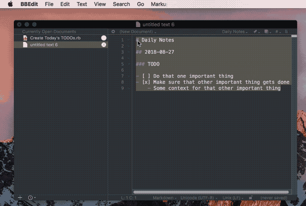

# daily-notes

Scripts for how I handle my "Daily Notes" Markdown file. Every day I highlight the previous day's TODOs, run the script as a Text Filter in BBEdit, and it rolls over any unfinished tasks into today's list. Every day you roll over a task, it will append a "+" to the "ROLLOVER" label so you can feel embarassed that you haven't gotten to that item in over 9 weeks.



## Instructions (for BBEdit)

1. Copy `Create Today's TODOs.rb` into `~/Library/Application Support/BBEdit/Text Filters/`
2. Create your first day's worth of TODOs in the following format: 
```
## 2019-03-26

### TODO

- [ ] Handle that important thing
	- Add any context you want with sub-items
```
3. If you finish a task, put an `x` in the `[ ]` to mark it complete.
4. The following day, highlight from the date header to the end of that day's TODO list, then run `Text => Apply Text Filter => Create Today's TODOs`.
	- If you want, you can run it the same day, and it will simply reorder the list by putting completed items at the bottom of today's list.